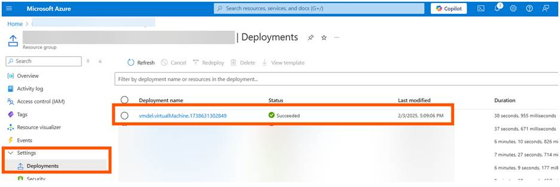

This TSG covers workaround steps specific to addressing an issue Microsoft has identified where a subset of Arc VMs deleted between Jan 31th, 2025 and Feb 2nd, 2025 were not properly deleted.

## Symptom

On deleting an Arc VM in the specified time frame above, the Arc VM no longer exists in Azure but continues to run on-premises.

## Cause

A misconfiguration on one of the cloud components prevented Arc VM delete operations from flowing down to the Arc resource bridge.

> [!NOTE]
> This issue is not tied to any specific software releases for Azure Local.

## Mitigation Details

Microsoft resolved this issue via an emergency fix on February 2nd, 2025. All Arc VM deletions initiated after this date are expected to function as intended without further intervention.

### Workaround steps to clean up orphaned Arc VMs

1. Recreate the Arc VM from the Azure portal using the same values as the original orphaned VM for the below parameters:

    - Resource group
    - VM name
    - VM image
    - Admin credentials
    

    > [!NOTE]
> When recreating the Arc VM, ensure to uncheck guest management for the Arc VM and do not attach any NICs or disks.

    If you are unsure which resource group, the orphaned VM belonged to - you’ll need to navigate through your resource groups and go to the **Settings** section within each resource group and select the **Deployments** blade. Review the list of deployment names to identify whether the VM was part of that specific resource group.

    Example: **vmdel** was a sample VM that was orphaned.  
  
     

1. Once the Arc VM is successfully created, delete the newly created Arc VM from the Azure portal.

    Executing the above steps will ensure that the impacted Arc VM is fully cleaned up from the on-premises environment.

    
If you require further assistance, contact Microsoft Support.
