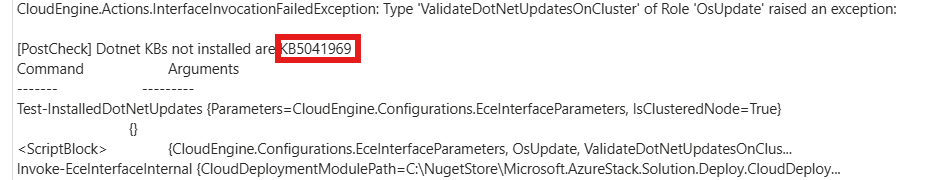
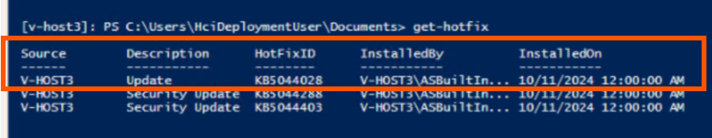

# Overview

As part of Azure Local Update, Cumulative Dot Net Updates are installed using the ValidateDotNetUpdatesOnCluster action under the OsUpdate role.

This TSG has the steps to mitigate the issue where the ValidateDotNetUpdatesOnCluster action fails causing the update to fail - when the customer applies an out of band .Net security updates on the stamp.

# Symptoms

Update fails with the following error message - 


```
Type 'ValidateDotNetUpdatesOnCluster' of Role 'OsUpdate' raised an exception:

[PostCheck] Dotnet KBs not installed are <kbNumber>
```

# Cause

This step serves as a validation to confirm that the .NET update KBs have been installed correctly on the cluster. If this step fails, it indicates issues with the successful completion of the Cluster-Aware Updating (CAU) run during the Update.

The step should be skipped only when the expected updates are already installed on the cluster, that is the if customers install .NET security updates out of band and install an update **newer** than the one (**_kbNumber_**) targeted by our Solution update, the update action plan will fail.

# Issue Validation

eg: Suppose if an update fails with the following message - 



This means that the targeted KB to be installed from the Update package is KB5041969. To verify if this is the latest KB,

- Search for KB number (**KB5041969**) in your web browser/search bar in support.microsoft.com. The results will show up a link to the KB release details for .NET framework updates ([link](https://support.microsoft.com/en-us/topic/august-13-2024-kb5041969-cumulative-update-for-net-framework-3-5-and-4-8-1-for-microsoft-server-operating-system-version-23h2-560d9e53-361f-4347-a9e4-296bd374b002)). From the link, it can be seen that the KB5041969 was released on _August 13, 2024._


- The same link will display the latest KBs released for Cumulative .NET Updates. Here, the latest KB released is **KB5044028** - which was released on _October 8, 2024._


To check if the KB5044028 is present on the stamp, 

- run the command **get-hotfix** which should provide a list of KB files and their installation details. Here, the KB5044028 is seen to be already installed - causing the Update to fail. 



If the version is present on all the nodes of the environment, this means that the stamp already has the newer version of the .NET cumulative updates (**KB5044028** from October). The failed steps can then be skipped in this scenario using the mitigation steps.

**Note:** The cause of CAU run failures will vary and if the step has not failed due to the above issue, do not use the mitigation steps mentioned below. If the above validation is not successful, collect the logs for the failed update and raise a support request for further investigation. 

# Mitigation Details

In order to mitigate the ICM, the ValidateDotNetUpdatesOnCluster task needs to be marked as skipped and then the update should be resumed.

Save the following script with a .ps1 extension to create a PowerShell script file. Then, execute it from one of the nodes within the cluster environment

```
$ErrorActionPreference = "Stop"

$failedUpdates = Get-ActionPlanInstances | where Status -eq "Failed" | where { $_.RuntimeParameters.updateId -match "Solution" }
if (-not $failedUpdates)
{
    throw "Cannot find the failed update action plan in ECE."
}

$update = $null
if ($failedUpdates.Count -gt 1)
{
    Write-Host "Found $($failedUpdates.Count) failed update action plans in ECE. Getting the most recently failed one."
    $update = $failedUpdates | sort EndDateTime | select -Last 1
}
else
{
    $update = $failedUpdates
}

Write-Host "Found action plan $($update.InstanceID) for update version $($update.RuntimeParameters.UpdateVersion)."

$xml = [xml]($update.ProgressAsXml)
$validateDotnetInterfaces = $xml.SelectNodes("//Task") | where RolePath -eq "Cloud\Fabric\OsUpdate" | where InterfaceType -eq "ValidateDotNetUpdatesOnCluster"
if (-not $validateDotnetInterfaces)
{
    throw "Cannot find interfaces of type 'ValidateDotNetUpdatesOnCluster' in the action plan."
}

Write-Host "Modifying status of $($validateDotnetInterfaces.Count) ValidateDotNetUpdatesOnCluster interfaces to 'Skipped'."
foreach ($interface in $validateDotnetInterfaces)
{
    if ($interface.HasAttribute("Status"))
    {
        $interface.Status = "Skipped"
    }
    else
    {
        $newStatusAttribute = $xml.CreateAttribute("Status")
        $newStatusAttribute.Value = "Skipped"
        $interface.Attributes.SetNamedItem($newStatusAttribute) | Out-Null
    }
}

$modifiedActionPlanPath = Join-Path $env:TEMP "modifiedUpdateValidateDotnetSkipped.xml"
Write-Host "Saving modified action plan to $modifiedActionPlanPath"
$xml.Save($modifiedActionPlanPath)

Write-Host "Resuming update action plan using the modified action plan XML."
Invoke-ActionPlanInstance -ActionPlanPath $modifiedActionPlanPath -ExclusiveLock -Retries 3
```